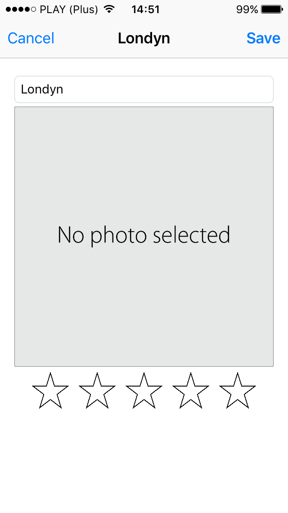

# README #

### Podstawowe informacje ###

Aplikacja objemuje poniższe funkcjonalności:
* Listę ulubionych miejsc (zdjęcie + opis)
* Zmianę kolejności ulubionych miejsc na liście
* Dodawanie nowych miejsc do listy (z galerii lub poprzez zrobienie zdjęcia)
* Możliwość dodawania i edycji opisu do ulubionego miejsca

### MyPlaces - lista ulubionych miejsc###

Ekran głowny:

### Możliwość usuwania oraz edycji kolejności na liście ###

### Dodawnia nowego miejsca ###

Dodawanie nowego miejsca, możliwości edycji:

* nazwa miejsca
* zdjęcie
* ocena
* opis -> w przyszłości 